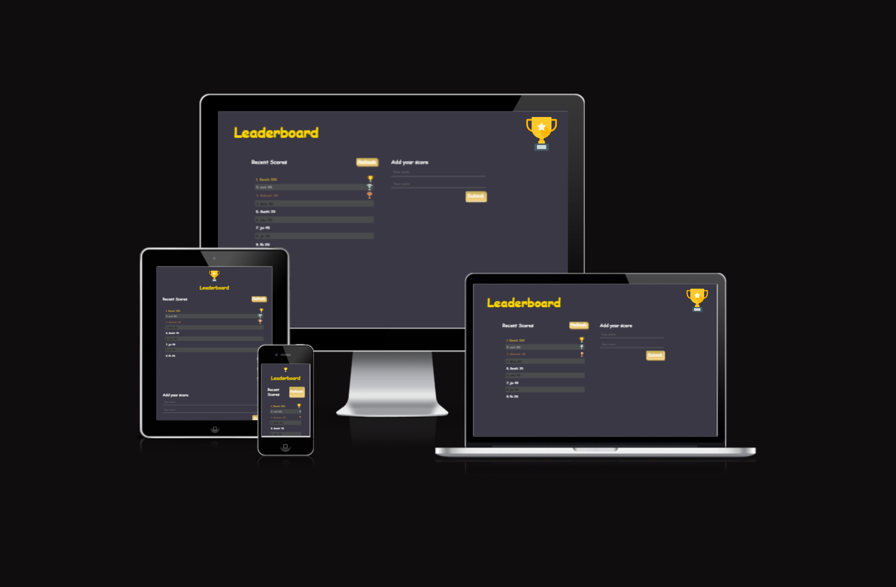

# Leaderboard
The goal of this educational project is to create a simple Leaderboard app using JavaScript, HTML, CSS and Webpack. This Application consumes data from an API to display scores for a game by sending and receiving data from/to the Leaderboard API.

## Built With
- HTML5, CSS3 and JavaScript
- Webpack
- Linters
- Git and GitHub
- GitHub Pages
- GitFlow 

## Website Mockup 📱 💻 🖥️

  
## Live Demo 

Now it is available :smile: [Leaderboard](https://miliyonayalew.github.io/Leaderboard/)
## Getting Started
To get a local copy up run the following steps.

## Prerequisites
- Node.js
- Git
- Web Browser
- Vscode(optional)

## Setup
- Clone the repository to your local machine using `git clone` https://github.com/Miliyonayalew/Leaderboard.git command.
- `npm i` to install all the dependencies
- `npm run` build to build the project
- `npm start` to start the server

## Author

👤 **Miliyon Ayalew**

- GitHub: [@Miliyonayalew](https://github.com/Miliyonayalew/)
- Twitter: [@MilaAyalew](https://twitter.com/MilaAyalew)
- LinkedIn: [@miliyon-ayalew](https://www.linkedin.com/in/miliyon-ayalew-210808131/)

## 🤝 Contributing

Contributions, issues, and feature requests are welcome!

Feel free to check the [issues page](../../issues/).

## Show your support

Give a ⭐️ if you like this project!

## Acknowledgments

- Inspiration 

## 📝 License

This project is [MIT](./LICENSE) licensed.
